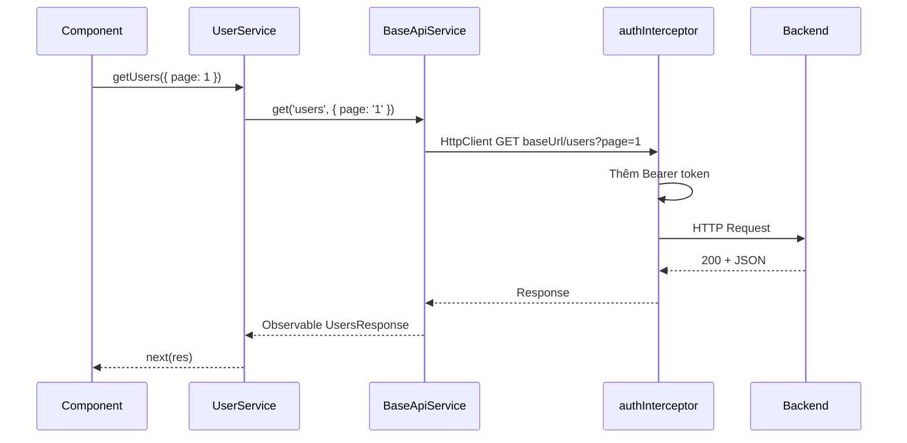

# Hướng dẫn Base API Service & Service con

Tài liệu mô tả cách cấu hình và triển khai layer gọi API trong dự án Angular AI, dựa trên code thực tế tại `src/app/core/api/`.

---

## 1. Tổng quan kiến trúc

```
Component / Page
       │
       ▼
  Service con (AuthService, UserService, ...)
       │  extends BaseApiService
       ▼
  BaseApiService  ──►  HttpClient
       │                    │
       │                    ▼
       │              authInterceptor (Bearer token, refresh)
       ▼
  ApiConfigService  ──►  environment.services
```

| Thành phần | Vai trò |
|------------|---------|
| `environment.services` | Khai báo base URL cho từng microservice / module |
| `ApiConfigService` | Lấy URL theo tên service (`auth`, `user`, …) |
| `BaseApiService` | Wrapper `get/post/put/patch/delete` + xử lý lỗi chung |
| Service con | Định nghĩa endpoint, model, logic nghiệp vụ |
| `authInterceptor` | Gắn `Authorization: Bearer …`, refresh token khi hết hạn |

**Thư mục liên quan:**

```
src/app/core/api/
├── api-config.service.ts
├── base-api.service.ts
├── auth.service.ts          ← ví dụ: auth + state
├── auth-token.service.ts    ← lưu token (không extend BaseApi)
└── user.service.ts          ← ví dụ: CRUD đơn giản

src/app/core/interceptors/
└── auth.interceptor.ts

src/app/environments/
├── environment.ts
└── environment.prod.ts
```

---

## 2. Cấu hình base URL (`environment` + `ApiConfigService`)

### 2.1. Khai báo trong `environment.ts`

Mỗi service con map với **một key** trong `environment.services`:

```ts
// src/app/environments/environment.ts
export const environment = {
  production: false,
  services: {
    base: 'http://localhost:3000',
    auth: 'http://localhost:3001',
    user: 'http://localhost:3001',
    product: 'http://localhost:3003/api',
    order: 'http://localhost:3004/api',
    payment: 'http://localhost:3005/api',
    notification: 'http://localhost:3006/api',
  },
};
```

**Dev với proxy** (`npm start` dùng `proxy.conf.json`): nên trỏ về path tương đối để tránh CORS:

```ts
services: {
  auth: '/api-auth',
  user: '/api-users',
  product: '/api-products',
  // ...
}
```

Proxy rewrite `/api-auth` → `http://localhost:3000/api` (xem `proxy.conf.json`).

### 2.2. `ApiConfigService`

```ts
@Injectable({ providedIn: 'root' })
export class ApiConfigService {
  getUrl(service: keyof typeof environment.services): string {
    return environment.services[service];
  }
}
```

TypeScript tự suy ra `ServiceName` từ `environment.services` — thêm key mới vào `environment` là có type an toàn.

---

## 3. `BaseApiService` — lớp nền

File: `src/app/core/api/base-api.service.ts`

### 3.1. Trách nhiệm

- Inject `HttpClient` và `ApiConfigService`
- Service con **bắt buộc** gán `serviceName` → tính `baseUrl`
- Cung cấp 5 method HTTP có `catchError` thống nhất
- **Không** `providedIn: 'root'` — chỉ service con mới đăng ký DI

### 3.2. Cách build URL

```
{baseUrl}/{endpoint}
```

Ví dụ:

- `serviceName = 'auth'`, `baseUrl = 'http://localhost:3001'`
- `this.post('auth/login', body)` → `POST http://localhost:3001/auth/login`

> **Lưu ý:** `endpoint` là path **sau** base URL, không cần dấu `/` đầu.

### 3.3. API method

| Method | Signature | Mô tả |
|--------|-----------|--------|
| `get` | `get<T>(endpoint, params?)` | Query string qua `HttpParams` |
| `post` | `post<T>(endpoint, body)` | Body JSON |
| `put` | `put<T>(endpoint, body)` | |
| `patch` | `patch<T>(endpoint, body)` | |
| `delete` | `delete<T>(endpoint)` | |

### 3.4. Xử lý lỗi mặc định

`handleError` map HTTP status → message tiếng Việt, rồi `throwError` object có thêm field `message`:

| Status | Message |
|--------|---------|
| `0` | Không thể kết nối đến server |
| `401` | Phiên đăng nhập hết hạn |
| `403` | Không có quyền |
| `404` | Không tìm thấy tài nguyên |
| `>= 500` | Lỗi server |

Trong component subscribe `error`, dùng: `err?.message`.

---

## 4. Tạo service con — quy trình chuẩn

### Bước 1: Thêm base URL vào `environment.services`

```ts
services: {
  // ...
  invoice: '/api-invoices', // hoặc URL production
}
```

### Bước 2: Thêm proxy (chỉ dev, nếu cần)

```json
"/api-invoices": {
  "target": "http://localhost:3000",
  "secure": false,
  "changeOrigin": true,
  "pathRewrite": { "^/api-invoices": "/api" }
}
```

### Bước 3: Tạo file service

`src/app/core/api/invoice.service.ts`:

```ts
import { Injectable } from '@angular/core';
import { Observable } from 'rxjs';
import { BaseApiService } from './base-api.service';

export interface InvoiceDto {
  id: string;
  amount: number;
}

export interface InvoicesResponse {
  data: InvoiceDto[];
  meta: { total: number; page: number; limit: number };
}

@Injectable({ providedIn: 'root' })
export class InvoiceService extends BaseApiService {
  protected override readonly serviceName = 'invoice' as const;

  getInvoices(page = 1, limit = 20): Observable<InvoicesResponse> {
    return this.get<InvoicesResponse>('invoices', {
      page: String(page),
      limit: String(limit),
    });
  }

  getById(id: string): Observable<InvoiceDto> {
    return this.get<InvoiceDto>(`invoices/${id}`);
  }

  create(body: Partial<InvoiceDto>): Observable<InvoiceDto> {
    return this.post<InvoiceDto>('invoices', body);
  }

  update(id: string, body: Partial<InvoiceDto>): Observable<InvoiceDto> {
    return this.patch<InvoiceDto>(`invoices/${id}`, body);
  }

  remove(id: string): Observable<void> {
    return this.delete<void>(`invoices/${id}`);
  }
}
```

**Checklist service con:**

- [ ] `extends BaseApiService`
- [ ] `@Injectable({ providedIn: 'root' })`
- [ ] `protected override readonly serviceName = '...' as const`
- [ ] Key `serviceName` có trong `environment.services`
- [ ] Interface response khớp backend (thường bọc trong `data`, `meta`, …)
- [ ] Không gọi `HttpClient` trực tiếp trong component

### Bước 4: Dùng trong component

```ts
private readonly invoiceService = inject(InvoiceService);

load(): void {
  this.invoiceService.getInvoices(1, 20).subscribe({
    next: (res) => this.items.set(res.data),
    error: (err) => this.error.set(err?.message ?? 'Lỗi tải dữ liệu'),
  });
}
```

Nên dùng `takeUntilDestroyed()` hoặc `takeUntil(destroy$)` để tránh memory leak.

---

## 5. Ví dụ thực tế trong dự án

### 5.1. `UserService` — service đơn giản (chỉ gọi API)

```ts
@Injectable({ providedIn: 'root' })
export class UserService extends BaseApiService {
  protected override readonly serviceName = 'user' as const;

  getUsers(params: GetUsersParams = {}): Observable<UsersResponse> {
    const queryParams: Record<string, string> = {};
    if (params.page != null) queryParams['page'] = String(params.page);
    if (params.limit != null) queryParams['limit'] = String(params.limit);

    return this.get<UsersResponse>('users', queryParams);
  }
}
```

**Backend response** (Users page):

```json
{
  "statusCode": 200,
  "success": true,
  "message": "...",
  "data": [ /* UserDto[] */ ],
  "meta": { "total": 100, "page": 1, "limit": 20 }
}
```

Component map `res.data` → view model (xem `pages/dashboard/users/users.ts`).

### 5.2. `AuthService` — service có state + transform response

Pattern phức tạp hơn:

1. Khai báo `AuthResponse` (raw từ BE) và `AuthPayload` (đã tách `data`)
2. `map((res) => res.data)` sau `post`
3. `tap` để lưu token / user (`handleAuthSuccess`)
4. `rememberMe` **không** gửi lên API — truyền tham số thứ 2 của `login()`

```ts
login(payload: LoginPayload, rememberMe = false): Observable<AuthPayload> {
  return this.post<AuthResponse>('auth/login', payload).pipe(
    map((res) => res.data),
    tap((res) => this.handleAuthSuccess(res, rememberMe)),
  );
}
```

**Response BE login:**

```json
{
  "data": {
    "accessToken": "...",
    "refreshToken": "...",
    "expiresIn": "...",
    "user": { "id", "email", "name", "role" }
  }
}
```

---

## 6. HttpClient & Interceptor

Đăng ký trong `app.config.ts`:

```ts
provideHttpClient(withInterceptors([authInterceptor])),
```

`authInterceptor` tự động:

- Gắn header `Authorization: Bearer <accessToken>` cho request không phải auth public
- Refresh token khi access token hết hạn (hoặc nhận `401`)
- Clear session + redirect `/login` khi refresh fail

**Endpoint không gắn token** (định nghĩa trong `isAuthEndpoint`):

- `auth/login`, `auth/register`, `auth/refresh`, `auth/logout`
- `auth/forgot-password`, `auth/reset-password`

Service con **không** cần tự set header Bearer — interceptor lo.

Chi tiết JWT: xem `JWT_AUTHENTICATION_GUIDE.md`.

---

## 7. Quy ước đặt tên & tổ chức

| Quy ước | Gợi ý |
|---------|--------|
| File service | `{domain}.service.ts` trong `core/api/` |
| `serviceName` | trùng key trong `environment.services` |
| Interface | đặt cùng file service hoặc `models/` nếu lớn |
| Endpoint | snake/kebab theo BE: `auth/forgot-password` |
| State toàn app | signal trong service (như `AuthService.currentUser`) |
| Token | `AuthTokenService` — tách riêng, không extend BaseApi |

---

## 8. Mẫu map response backend

### Bọc trong `data`

```ts
interface ApiWrapper<T> {
  data: T;
}

getItem(id: string): Observable<Item> {
  return this.get<ApiWrapper<Item>>(`items/${id}`).pipe(
    map((res) => res.data),
  );
}
```

### Paginated list

```ts
getUsers(params): Observable<UsersResponse> {
  return this.get<UsersResponse>('users', queryParams);
}
// Component: res.data, res.meta.total
```

### Lỗi từ BE có `message` nested

```ts
error: (err) => {
  const msg =
    err?.message ??                    // từ handleError BaseApi
    err?.error?.message ??             // từ body NestJS
    'Đã xảy ra lỗi';
}
```

---

## 9. Sơ đồ luồng một request



---

## 10. FAQ / Lỗi thường gặp

**Q: Login thành công nhưng không vào được `/dashboard`?**  
A: Kiểm tra `handleAuthSuccess` / `tap` sau login có chạy không — `authGuard` dựa vào `isLoggedIn()` (user + token).

**Q: Gọi API bị CORS?**  
A: Dev dùng proxy (`/api-auth`, …), không gọi thẳng `localhost:3000` từ browser nếu BE chưa bật CORS.

**Q: Thêm microservice mới?**  
A: `environment.services` → (proxy) → service con với `serviceName` khớp key.

**Q: Có nên gọi `HttpClient` trong component?**  
A: Không — luôn qua service con để tái sử dụng URL, typing, error handling.

**Q: `BaseApiService` có cần `constructor() { super(); }`?**  
A: Chỉ khi service con có constructor riêng (như `AuthService`).

---

## 11. Tài liệu liên quan

| File | Nội dung |
|------|----------|
| `JWT_AUTHENTICATION_GUIDE.md` | Login, refresh, logout chi tiết |
| `SETUP_AND_CONFIG.md` | Cấu hình môi trường |
| `proxy.conf.json` | Proxy dev |
| `src/app/core/api/user.service.ts` | Mẫu service CRUD |
| `src/app/core/api/auth.service.ts` | Mẫu service + state |

---

*Tài liệu đồng bộ với codebase tại nhánh hiện tại. Khi đổi cấu trúc `environment` hoặc `BaseApiService`, cập nhật file này tương ứng.*
